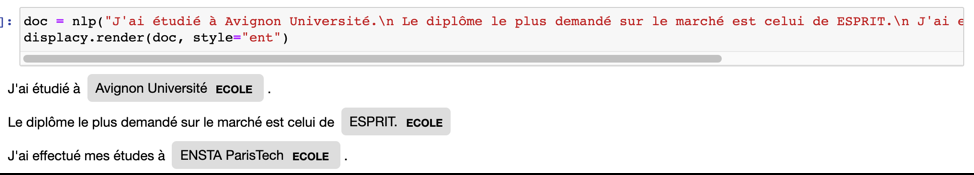

## Ajout de nouvelles entités basées sur l’entraînement

### 1) spaCy
Le modèle Spacy permet d’ajouter de nouvelles entités en les entraînant.

Dans notre cas d’étude, le nom des écoles fait partie des données à caractère personnel. 
C’est pour cela qu’on a besoin de détecter cette entité pour pouvoir l’anonymiser.

On a a pris comme exemple les phrases : 

« "J'ai étudié à Avignon Université. »

« Le diplôme le plus demandé sur le marché est celui de ESPRIT. »

« J’ai effectué mes études à ENSTA ParisTech. »

Après avoir ajouté la nouvelle entité « ECOLE », le modèle a pu détecter « Avignon Université. », « ESPRIT » et « ENSTA ParisTech » comme « ECOLE ». 

 