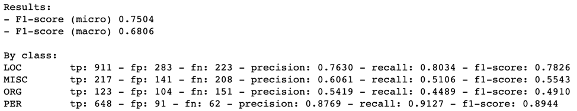

## Le modèle Flair + Plongements empilés (Stacked Embeddings)

L’algorithme consiste à :
1)	Obtenir le corpus français à partir des datasets existants dans Flair. Pour tester dans un premier temps on n’a utilisé qu’un échantillon de ce corpus à cause des limites de performance de la machine.
2)	Identifier le tag qu’on veut prédire. Dans notre cas d’étude, ce qui nous intéresse est le Named Entity Recognition (NER).
3)	Créer le dictionnaire des tags à partir du corpus, autrement dit ce sont toutes les étiquettes disponibles dans le corpus.
4)	Initialiser les plongements de mots qu’on veut utiliser dans une liste, ce qui va nous permettre d’utiliser plusieurs plongements à la fois grâce au concept « Stacked Embeddings » (ou bien les plongements empilés). Ce concept permet de combiner de différents plongements ensemble et donne souvent les meilleurs résultats.
On n’aura donc qu’à transmettre la liste des plongements qu’on veut utiliser à l’instanciation de la classe StackedEmbeddings.
5)	Initialiser le sequence tagger.
6)	Initialiser le modèle d’entraînement.
7)	Commencer l’entraînement. Pour tester dans un premier temps, on a fixé le paramètre « max_epochs » à 3 à cause des limites de performance de la machine.
8)	Flair va créer un nouveau répertoire appelé « ressources » dans notre répertoire de travail actuel où on trouvera tout, des logs d'entraînement, des informations de perte (loss) aux prédictions sur l'ensemble de test avec un score de confiance. Dans le même répertoire, notre modèle sera enregistré.
9)	Utiliser le modèle qu’on vient d’entraîner pour prédire les tags d'une nouvelle séquence de texte.

### 1) Le modèle Flair + Plongements de CamemBert
#### a) NER de l’entraînement du modèle Flair combiné avec les plongements de CamemBert
Vu que CamemBERT est l’application déclinée pour la langue française du modèle contextuel de langue le plus courant BERT, on a opté pour utiliser ses plongements dans le modèle Flair pour exploiter à la fois de la précision de ce dernier et de la capacité de CamemBert à manier parfaitement la langue française en identifiant et caractérisant dans un texte les noms propres, les verbes, les adverbes, les adjectifs, en distinguant toute la grammaire et la syntaxe française, avec un taux de réussite à 99%.

On a pris comme exemple la phrase : « Emma Louise, habite au 26 rue Alexandre, 75005 Paris, France, née le 11/11/1993. Elle travaille chez Zenika et elle est joignable sur 06660006. »

Le modèle a permis de reconnaître les entités suivantes :
-	L’entité « PER » reconnue par le groupe composé par les 2 mots « Emma » et « Louise ».
-	L’entité « LOC » reconnue par les mots « rue », « Alexandre », « 75005 », « Paris » et « France ».
-	L’entité « ORG » reconnue par le mot « Zenika ».

#### b) Evaluation du modèle résultant de l’entraînement de Flair avec les plongements de CamemBert

 

La combinaison du modèle Flair et les plongements de CamemBert a donné de meilleurs résultats d’inférence par rapport à ceux de Flair ou de CamemBert séparément.

Les résultats de notre modèle qu’on vient d’entraîner sont plus satisfaisants pour notre cas d’utilisation. 

D’ailleurs, c’est le seul modèle qui a pu détecter « Zenika » comme « ORG », « rue » comme « LOC » et le code postal « 75005 » comme « LOC ».

### 2) Le modèle Flair + Plongements de FlauBert
#### a) NER de l’entrainement du modèle Flair combiné avec les plongements de Flaubert
On a pris comme exemple la phrase : « Emma Louise, habite au 26 rue Alexandre, 75005 Paris, France, née le 11/11/1993. Elle travaille chez Zenika et elle est joignable sur 06660006. »

Le modèle a permis de reconnaître les entités suivantes :
-	L’entité « PER » reconnue par le groupe composé par les 2 mots « Emma » et « Louise ».
-	L’entité « PER » reconnue par le mot « Alexandre » alors qu’il s’agit du nom de la rue.
-	L’entité « LOC » reconnue par les mots « 75005 », « Paris » et « France ».
-	L’entité « MISC » reconnue par le mot « Zenika ». Ce qui signifie que le modèle a reconnu « Zenika » comme entité nommée mais qui ne fait pas partie des entités « PER », « LOC » ou « MISC ».

#### b) Evaluation du modèle résultat de l’entraînement de Flair avec les plongements de FlauBert

 

La combinaison du modèle Flair et les plongements de FlauBert a donné de moyens résultats d’inférence par rapport à ceux de Flair combiné avec les plongements de CamemBert.

En effet, le modèle qu’on vient de tester a reconnu « Zenika » comme « MISC » au lieu de « ORG ».

De plus, il a reconnu « Alexandre » comme « PER », alors qu’il s’agit du nom de la rue.

### 3) Le modèle Flair + Plongements de LePetit
#### a) NER de l’entrainement du modèle Flair combiné avec les plongements de LePetit
On a pris comme exemple la phrase : « Emma Louise, habite au 26 rue Alexandre, 75005 Paris, France, née le 11/11/1993. Elle travaille chez Zenika et elle est joignable sur 06660006. »

 

Le modèle a permis de reconnaître les entités suivantes :
-	L’entité « PER » reconnue par le groupe composé par les 2 mots « Emma » et « Louise ».
-	L’entité « LOC » reconnue par les mots « rue », « Alexandre », « Paris » et « France ».
-	L’entité « ORG » reconnue par le mot « Zenika ».

#### b) Evaluation du modèle résultat de l’entraînement de Flair avec les plongements de LePetit

 

La combinaison du modèle Flair et les plongements de LePetit a donné de bons résultats d’inférence par rapport à ceux de Flair combiné avec les plongements de FlauBert.

Mais ses résultats d’inférence étaient moins bons que ceux de Flair combiné avec les plongements de CamemBert. 

En effet, il n’a pas reconnu le code postal « 75005 » comme « LOC ».

### 4) Le modèle Flair + Plongements combinés de Camembert, Flaubert et LePetit
#### a) NER de l’entrainement du modèle Flair combiné avec les plongements combinés de Camembert, Flaubert et LePetit 
On a pris comme exemple la phrase : « Emma Louise, habite au 26 rue Alexandre, 75005 Paris, France, née le 11/11/1993. Elle travaille chez Zenika et elle est joignable sur 06660006. »

 

Le modèle a permis de reconnaître les entités suivantes :
-	L’entité « PER » reconnue par le groupe composé par les 2 mots « Emma » et « Louise ».
-	L’entité « PER » reconnue par le mot « Alexandre » alors qu’il s’agit du nom de la rue.
-	L’entité « LOC » reconnue par les mots « 75005 », « Paris » et « France ».
-	L’entité « MISC » reconnue par le mot « Zenika ». Ce qui signifie que le modèle a reconnu « Zenika » comme entité nommée mais qui ne fait pas partie des entités « PER », « LOC » ou « MISC ».

#### b) Evaluation du modèle résultat de l’entraînement de Flair avec les plongements combinés de Camembert, Flaubert et LePetit

La combinaison du modèle Flair et les plongements combinés de Camembert, Flaubert et LePetit a donné de moyens résultats d’inférence par rapport à ceux de Flair combiné avec les plongements de CamemBert.

En effet, le modèle qu’on vient de tester a reconnu « Zenika » comme « MISC » au lieu de « ORG ».

De plus, il a reconnu « Alexandre » comme « PER », alors qu’il s’agit du nom de la rue.

### 5) Le modèle Flair + Plongements combinés de Camembert et LePetit
#### a) NER de l’entrainement du modèle Flair combiné avec les plongements combinés de Camembert et LePetit 
On a pris comme exemple la phrase : « Emma Louise, habite au 26 rue Alexandre, 75005 Paris, France, née le 11/11/1993. Elle travaille chez Zenika et elle est joignable sur 06660006. »

Le modèle a permis de reconnaître les entités suivantes :
-	L’entité « PER » reconnue par le groupe composé par les 2 mots « Emma » et « Louise ».
-	L’entité « LOC » reconnue par les mots « rue », « Alexandre », « Paris » et « France ».
-	L’entité « ORG » reconnue par le mot « Zenika ».

#### b) Evaluation du modèle résultat de l’entraînement de Flair avec les plongements combinés de Camembert et LePetit 

 

La combinaison du modèle Flair et les plongements combinés de Camembert et LePetit a donné de bons résultats d’inférence par rapport à la plupart des modèles.

Mais ses résultats d’inférence étaient moins bons que ceux de Flair combiné avec les plongements de CamemBert. 

En effet, il n’a pas reconnu le code postal « 75005 » comme « LOC ».

### 6) Benchmarking des modèles
#### a) Résultats

| Modèle                                   | F1-score | F1-score de l’entité « PER » | F1-score de l’entité « LOC » | F1-score de l’entité « ORG » | F1-score de l’entité « MISC » |
|------------------------------------------|----------|------------------------------|------------------------------|------------------------------|-------------------------------|
| Flair + CamemBert                        | 0.8351   | 0.9314                       | 0.8287                       | 0.7739                       | 0.7106                        |
| Flair + FlauBert                         | 0.7853   | 0.9209                       | 0.7984                       | 0.6087                       | 0.6065                        |
| Flair + LePetit                          | 0.7578   | 0.8748                       | 0.7610                       | 0.6334                       | 0.5736                        |
| Flair + (Camembert + FlauBert + LePetit) | 0.7504   | 0.8944                       | 0.7826                       | 0.4910                       | 0.5543                        |
| Flair + (Camembert + LePetit)            | 0.8222   | 0.9202                       | 0.8308                       | 0.6987                       | 0.6701                        |

Le tableau ci-dessus montre que tous les modèles ont obtenu des résultats décents lorsqu’il s’agit du F1-score de toutes les entités confondues de chaque modèle et le F1-score de chaque entité indépendamment a montré que :
-	La combinaison du modèle Flair et les plongements de CamemBert a donné les F1-score les plus élevés de tous les modèles.
-	La combinaison du modèle Flair et les plongements combinés de Camembert et LePetit a donné les F1-score les moins élevés de tous les modèles.

#### b) Performance de calcul
Bien que le modèle Flair combiné avec les plongements de CamemBert ait donné les F1-score les plus élevés, il n’est pas le plus rapide à s'entraîner ou à prédire. 

Le tableau ci-dessous montre la durée d'apprentissage et d'inférence approximative en utilisant les divers modèles évalués. 

L'analyse a été faite sur une machine CPU (2,6 GHz Intel Core i7 6 cœurs).

Pour tester dans un premier temps, on n’a utilisé qu’un échantillon du corpus français à partir des datasets existants dans Flair et on a fixé le paramètre « max_epochs » à 3 à cause des limites de performance de la machine.

| Modèle                                   | Durée d'apprentissage (en heures) | Durée d’inférence (en millisecondes) |
|------------------------------------------|-----------------------------------|--------------------------------------|
| Flair + CamemBert                        | ~2,266                            | 171                                  |
| Flair + FlauBert                         | ~5,166                            | 757                                  |
| Flair + LePetit                          | ~0,5                              | 54.5                                 |
| Flair + (Camembert + FlauBert + LePetit) | ~8,533                            | 1150                                 |
| Flair + (Camembert + LePetit)            | ~2,3                              | 327                                  |

Le tableau ci-dessus montre que :
-	Le modèle Flair combiné avec les plongements de LePetit est le modèle le plus rapide à s’entraîner et à prédire.
-	Le modèle Flair combiné avec les plongements de CamemBert, FlauBert et LePetit est le modèle le plus lent à s’entraîner et à prédire.