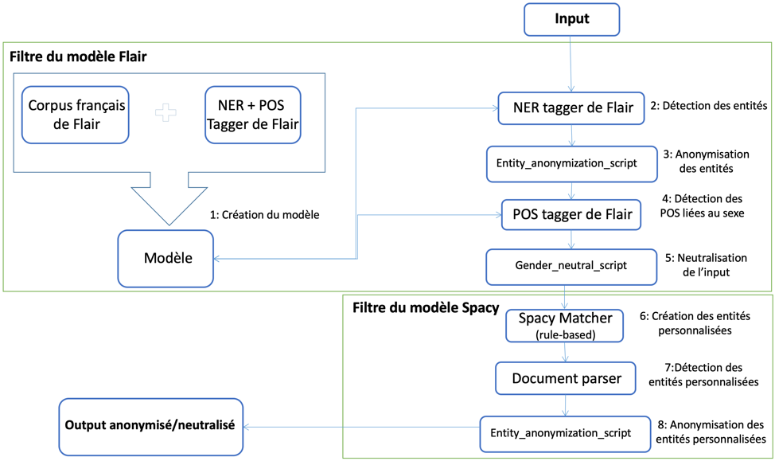

## Le modèle Flair + spaCy

 

La figure ci-dessus montre la démarche qu’on a suivi dans l’un de nos essais :

1 : Créer un modèle de prédiction en utilisant un corpus français de Flair et des taggers de NER et POS (respectivement Named Entity Recognition et Part Of Speech) du modèle Flair.

2 : Commencer par utiliser le « Sequence Tagger » de NER du modèle Flair pour détecter les entités dans notre input.

3 : Exécuter un script qui permet de remplacer la valeur du texte des entités par une valeur anonyme.

4 : Utiliser le « Sequence Tagger » de POS du modèle Flair afin de détecter les mots liés au sexe (tout mot qui peut indiquer implicitement le sexe de la personne en question).

5 : Exécuter un script qui permet de convertir tout mot spécifique au sexe en un mot neutre.

6 : Pour que l'output soit totalement anonyme, on doit creuser plus profondément et rechercher des entités spécifiques que ni Flair ni Spacy n'ont la capacité de détecter, c'est pourquoi on a utilisé un outil fourni par spaCy, qui permet de créer nos propres entités basées sur des règles (on définit le pattern à suivre et le « Matcher » détecte les nouvelles entités qui correspondent à ces règles).
Les entités qu’on a pu créer grâce au « Rule-based Entities » :
-	**« S-DATE »** : si la date renseignée est composée seulement de l’année.
-	**« DATE »** : si la date renseignée suit le format jj/mm/aaaa.
-	**« Num_Sec_So »** : cela permet de détecter le numéro de sécurité sociale.
-	**« AGE »** : cela permet de détecter l’âge.
-	**« SIT_FAM »** : cela permet de détecter la situation familiale.
-	**« FORMATION »** : cela permet de détecter la durée de la formation suivie par le candidat.
-	**« nbr_enfants »** : cela permet de détecter le nombre d’enfants qu’a le candidat.
-	**« sexe »** : cela permet de détecter si le candidat a mentionné explicitement son sexe dans le CV.

7 : Exécuter un script qui permet de détecter et de renvoyer les entités personnalisées qu’on vient de créer grâce aux « Rule-based Entities ».

8 : Exécuter un script qui permet de remplacer la valeur du texte des entités par une valeur anonyme.
