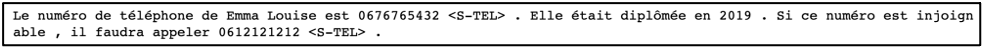
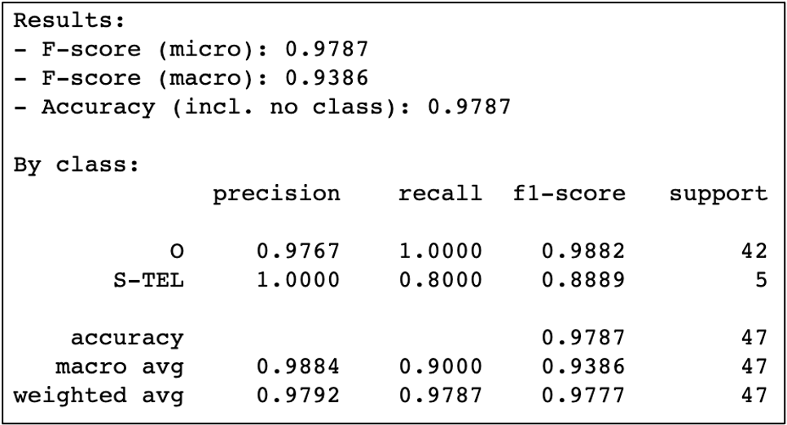
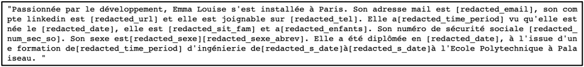

## Le modèle Flair + Plongements de CamemBert en l’entraînant avec un nouveau dataset de numéros de téléphone qu’on vient de créer :

Le modèle Flair combiné avec les plongements de CamemBert n’est pas capable de détecter plusieurs entités, parmi lesquelles les numéros de téléphone, lorsqu’il est entraîné avec le corpus français de Flair.

On a opté donc pour la création de notre propre corpus qui permet de détecter, dans un premier temps, les numéros de téléphone.

Chaque numéro de téléphone dans le corpus a comme tag « < S-TEL > ».

### - NER de l’entraînement du modèle Flair combiné avec les plongements de CamemBert avec un corpus d’un dataset de numéros de téléphone qu’on vient de créer

On a pris comme exemple la phrase : « Le numéro de téléphone de Emma Louise est 0676765432. Elle était diplômée en 2019. Si ce numéro est injoignable, il faudra appeler 0612121212. »

 

Le modèle a permis de reconnaître l’entité « TEL » reconnue par les mots « 0676765432 » et « 0612121212 ».

### - Evaluation du modèle résultant de l’entraînement de Flair avec les plongements de CamemBert avec un corpus d’un dataset de numéros de téléphone qu’on vient de créer

 

La combinaison du modèle Flair et les plongements de CamemBert a donné de très bons résultats.
Néanmoins, ce résultat reste à tester sur un dataset plus grand puisque le dataset qu’on vient de créer ne compte que 15 phrases.

## Expressions régulières

On a créé des expressions régulières qui permettent de détecter et anonymiser plus facilement les entités non reconnues par défaut dans Flair.

Les expressions régulières créées sont :
-	**« extract_email »** : qui permet d’extraire l’adresse mail.
-	**« extract_date»** : qui permet d’extraire une date sous la forme jj/mm/aaaa.
-	**« extract_num_so_sec»** : qui permet d’extraire le numéro de sécurité sociale.
-	**« extract_single_date»** : qui permet d’extraire une date qui est composée seulement de l’année.
-	**« extract_time_period»** : qui permet d’extraire une durée (nombre d’année de formation, âge).
-	**« extract_enfants»** : qui permet d’extraire le nombre d’enfants.
-	**« extract_sit_fam»** : qui permet d’extraire la situation familiale.
-	**« extract_sexe»** : qui permet d’extraire le sexe du candidat s’il l’a mentionné explicitement dans le CV (Masculin ou Féminin).
-	**« extract_sexe_abrev»** : qui permet d’extraire l’abréviation du sexe du candidat s’il l’a mentionné explicitement dans le CV (M ou F).
-	**« extract_tel»** : qui permet d’extraire le numéro de téléphone.
-	**« extract_url»** : qui permet d’extraire le lien du compte linkedin du candidat.

On a pris comme input la phrase : « Passionnée par le développement, Emma Louise s'est installée à Paris. Son adresse mail est emma.louise@google.com, son compte linkedin est https://www.linkedin.com/in/el-424781150/ et elle est joignable sur +33(0)987609876. Elle a 26 ans vu qu'elle est née le 16/11/1994, elle est mariée et a 2 enfants. Son numéro de sécurité sociale 2 94 11 99 205 148. Son sexe est Féminin (F) . Elle a été diplômée en 11/11/2018, à l'issue d'une formation de 5 ans d'ingénierie de 2013 à 2018 à l'Ecole Polytechnique à Palaiseau.»

L’output de ces expressions régulières est représenté par la figure ci-dessous :

 

**Remarque :**
La solution finale combinera 3 couches :
-	1ère couche : Traitement des CVs par les expressions régulières.
-	2ème couche : Reconnaissance des entités nommées par le NER du modèle Flair combiné avec les plongements de CamemBert.
-	3ème couche : Neutralisation des CVs grâce à l’écriture inclusive.
