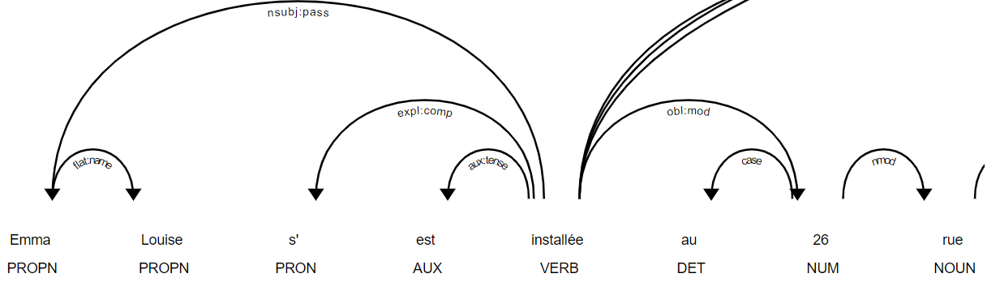
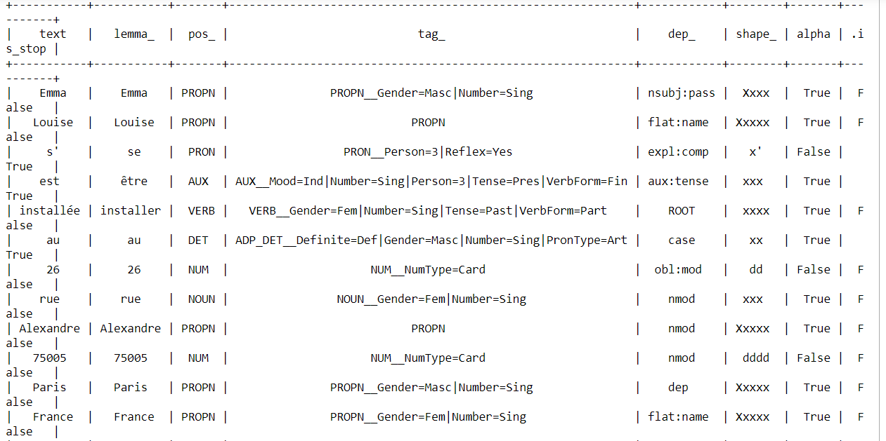
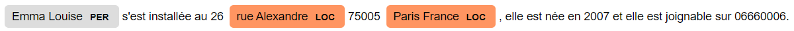
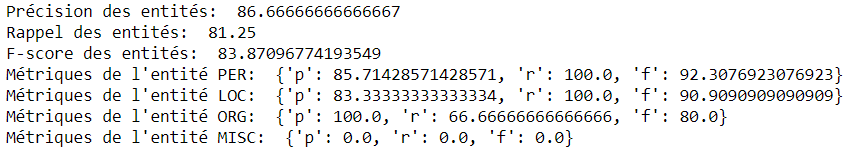
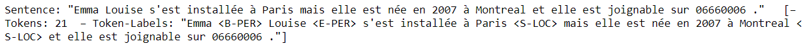
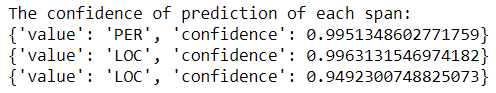

# Scénario 1: Input sous format texte

## 1)	Le modèle spaCy
### a) Part Of Speech (POS) Tagging 
Part Of Speech Tagging (ou l'étiquetage morpho-syntaxique) permet d’associer aux mots d'un texte les informations grammaticales correspondantes comme la partie du discours, le genre, le nombre, etc.

On a pris comme exemple la phrase suivante : "Emma Louise s'est installée au 26 rue Alexandre 75005 Paris France, elle est née en 2007 et elle est joignable sur 06660006."

Dans un 1er temps, on a affiché les dépendances entre les mots.
 

De différentes dépendances ont pu être détectées, elles sont toutes labellisées grâce aux étiquettes de dépendance syntaxique attribuées par les modèle spaCy :
-	Le mot « Emma » a été étiqueté par « nom propre » qui dépend du mot « Louise » (qui a été étiqueté par « nom propre » aussi).
-	Le mot « installée » a été étiqueté par « verbe » qui dépend du mot « est » (qui a été étiqueté par « auxiliaire »).
-	Le mot « installée » a été étiqueté par « verbe » qui dépend du mot « Emma » (qui a été étiqueté par « nom propre »).
-	Le mot « installée » a été étiqueté par « verbe » qui dépend du mot « s’ » (qui a été étiqueté par « pronom »).

Dans un 2ème temps, on a affiché le lemme, le Part Of Speech, et le tag de chaque mot.
 

Les tags du Part Of Speech attribués par le modèle spaCy permettent d’avoir une visibilité sur les données à caractères personnel vu qu’ils détectent :
-	Les noms propres des personnes, des rues, des villes, des pays (respectivement : « Emma », « Louise », « Alexandre », « Paris » et « France »).
-	Le sexe de la personne en se basant sur le genre du participe passé (le mot « installée » a comme tag « VERB__Gender=Fem|Number=Sing|Tense=Past|VerbForm=Part »
-	Les numéros qui peuvent servir à la détection des numéros de téléphones, du code postal, du numéro de logement, etc.

### b) Named Entity Recognition (NER)
La reconnaissance d'entités nommées permet de rechercher des objets textuels dans des classes telles que noms de personnes, noms d'organisations ou d'entreprises, noms de lieux, quantités, distances, valeurs, dates, etc.

On a pris comme exemple la même phrase : " Emma Louise s'est installée au 26 rue Alexandre 75005 Paris France, elle est née en 2007 et elle est joignable sur 06660006."
 

Le modèle spaCy a permis de reconnaître quelques entités nommées :
-	L’entité « PERSON » reconnue par le groupe de mots « Emma Louise ».
-	L’entité « LOCATION » reconnue par le groupe de mots « rue Alexandre » et « Paris France ».

### c) Evaluation du modèle spaCy
Pour évaluer l’inférence du modèle spaCy, on a opté pour calculer la précision, le rappel et le f-score de toutes les entités confondues puis de chaque entité séparée.
 

Le résultat de calcul de métriques n’est pas satisfaisant pour notre cas d’utilisation, que ce soit pour toutes les entités confondues ou bien pour chaque entité séparée.
Cela pourrait être amélioré si on combine le modèle spaCy avec des plongements de mots en français (tel que CamemBERT, etc).

## 2)	Le modèle Flair
### a) Named Entity Recognition (NER)
On a pris comme exemple la phrase suivante : " Emma Louise s'est installée à Paris mais elle est née en 2007 à Montreal et elle est joignable sur 06660006."
 

Le modèle Flair a permis de reconnaître quelques entités nommées :
-	L’entité « PER » reconnue par le groupe composé par les 2 mots « Emma » et « Louise ».
-	L’entité « LOC » reconnue par les mots « Paris » et « Montreal ».

### b) Evaluation du modèle Flair
Pour évaluer l’inférence du modèle Flair, on a opté pour calculer la confiance de chaque entité.

 

Le résultat de calcul de métriques semblerait satisfaisant pour notre cas d’utilisation pour ces entités reconnues par Flair (à savoir les entités « PERSON » et « LOCATION »).
Cela pourrait être amélioré si on combine le modèle Flair avec des plongements de mots en français (tel que CamemBERT, etc).
