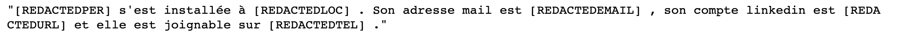
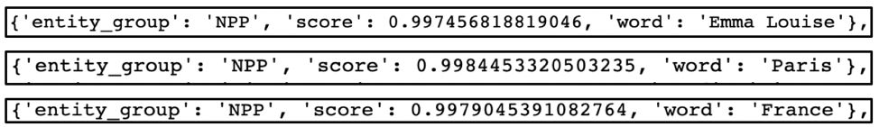
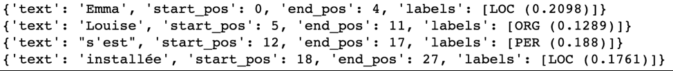
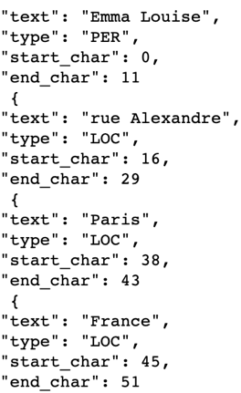

# Scénario 1: Input sous format texte

## 1)	Le modèle spaCy
### a) Part Of Speech (POS) Tagging 
Part Of Speech Tagging (ou l'étiquetage morpho-syntaxique) permet d’associer aux mots d'un texte les informations grammaticales correspondantes comme la partie du discours, le genre, le nombre, etc.

On a pris comme exemple la phrase suivante : "Emma Louise s'est installée au 26 rue Alexandre 75005 Paris France, elle est née en 2007 et elle est joignable sur 06660006."

Dans un 1er temps, on a affiché les dépendances entre les mots.
 

De différentes dépendances ont pu être détectées, elles sont toutes labellisées grâce aux étiquettes de dépendance syntaxique attribuées par les modèle spaCy :
-	Le mot « Emma » a été étiqueté par « nom propre » qui dépend du mot « Louise » (qui a été étiqueté par « nom propre » aussi).
-	Le mot « installée » a été étiqueté par « verbe » qui dépend du mot « est » (qui a été étiqueté par « auxiliaire »).
-	Le mot « installée » a été étiqueté par « verbe » qui dépend du mot « Emma » (qui a été étiqueté par « nom propre »).
-	Le mot « installée » a été étiqueté par « verbe » qui dépend du mot « s’ » (qui a été étiqueté par « pronom »).

Dans un 2ème temps, on a affiché le lemme, le Part Of Speech, et le tag de chaque mot.
 

Les tags du Part Of Speech attribués par le modèle spaCy permettent d’avoir une visibilité sur les données à caractères personnel vu qu’ils détectent :
-	Les noms propres des personnes, des rues, des villes, des pays (respectivement : « Emma », « Louise », « Alexandre », « Paris » et « France »).
-	Le sexe de la personne en se basant sur le genre du participe passé (le mot « installée » a comme tag « VERB__Gender=Fem|Number=Sing|Tense=Past|VerbForm=Part »
-	Les numéros qui peuvent servir à la détection des numéros de téléphones, du code postal, du numéro de logement, etc.

### b) Named Entity Recognition (NER)
La reconnaissance d'entités nommées permet de rechercher des objets textuels dans des classes telles que noms de personnes, noms d'organisations ou d'entreprises, noms de lieux, quantités, distances, valeurs, dates, etc.

On a pris comme exemple la même phrase : " Emma Louise s'est installée au 26 rue Alexandre 75005 Paris France, elle est née en 2007 et elle est joignable sur 06660006."
 

Le modèle spaCy a permis de reconnaître quelques entités nommées :
-	L’entité « PERSON » reconnue par le groupe de mots « Emma Louise ».
-	L’entité « LOCATION » reconnue par le groupe de mots « rue Alexandre » et « Paris France ».

### c) Evaluation du modèle spaCy
Pour évaluer l’inférence du modèle spaCy, on a opté pour calculer la précision, le rappel et le f-score de toutes les entités confondues puis de chaque entité séparée.
 

Le résultat de calcul de métriques n’est pas satisfaisant pour notre cas d’utilisation, que ce soit pour toutes les entités confondues ou bien pour chaque entité séparée.
Cela pourrait être amélioré si on combine le modèle spaCy avec des plongements de mots en français (tel que CamemBERT, etc).

### d) Ajout de nouvelles entités
Le modèle Spacy permet d’ajouter de nouvelles entités. 
Dans notre cas d’étude, l’adresse mail, l’URL du profil Linkedin et le numéro de téléphone sont considérés comme des données à caractère personnel. 
C’est pour cela qu’on a besoin de détecter ces entités pour pouvoir les anonymiser dans l’étape qui suit.
On a a pris comme exemple la phrase « Emma Louise s'est installée à Paris. Son adresse mail est emma.louise@google.com, son compte linkedin est https://www.linkedin.com/in/el-424781150/ et elle est joignable sur +33987609876. »
Après avoir ajouté les nouvelles entités « EMAIL », « URL » et « TEL », le modèle a pu détecter « emma.louise@google.com » comme « EMAIL », « https://www.linkedin.com/in/el-424781150/ » comme « URL » et « +33987609876 » comme « TEL ». 
 

### e) Anonymisation des entités détectées
Après avoir pu détecter les entités à anonymiser, la dernière étape consiste à les remplacer ces entités détectées par d’autres mots anonymes.
On a pris comme exemple la même phrase précédente « Emma Louise s'est installée à Paris. Son adresse mail est emma.louise@google.com, son compte linkedin est https://www.linkedin.com/in/el-424781150/ et elle est joignable sur +33987609876. »
On a choisi de remplacer tout mot détecté comme :
-	 « PER » par le mot « REDACTED ». 
-	« LOC » par le mot « REDACTEDLOC ». 
-	« EMAIL » par le mot « REDACTEDEMAIL ». 
-	« URL » par le mot « REDACTEDURL ». 
-	« TEL » par le mot « REDACTEDTEL ». 

 

## 2)	Le modèle Flair
### a) Named Entity Recognition (NER)
On a pris comme exemple la phrase suivante : " Emma Louise s'est installée à Paris mais elle est née en 2007 à Montreal et elle est joignable sur 06660006."
 

Le modèle Flair a permis de reconnaître quelques entités nommées :
-	L’entité « PER » reconnue par le groupe composé par les 2 mots « Emma » et « Louise ».
-	L’entité « LOC » reconnue par les mots « Paris » et « Montreal ».

### b) Evaluation du modèle Flair
Pour évaluer l’inférence du modèle Flair, on a opté pour calculer la confiance de chaque entité.

 

Le résultat de calcul de métriques semblerait satisfaisant pour notre cas d’utilisation pour ces entités reconnues par Flair (à savoir les entités « PERSON » et « LOCATION »).
Cela pourrait être amélioré si on combine le modèle Flair avec des plongements de mots en français (tel que CamemBERT, etc).

## 3)	Le modèle CamemBert
### a) NER par le modèle CamemBert
On a pris comme exemple la phrase suivante : « Emma Louise, 26 rue Alexandre, 75005 Paris, France, née le 11/11/2007 et joignable sur 06660006. »

 
 
Le modèle a pu détecter les entités suivantes ayant comme Tag « NPP » qui signifie « Nom Propre » avec les scores d’inférence respectifs. Ces entités vont permettre d’identifier les données à caractère personnel. Parmi les entités qui ont pu être détectés :
-	« Emma Louise » : « NPP » ayant comme score 0.997
-	« Paris » : « NPP » ayant comme score 0.998
-	« France » : « NPP » ayant comme score 0.997

### b) NER par la combinaison du modèle Flair et les plongements de CamemBert
On a pris comme exemple la phrase suivante : « Emma Louise s'est installée au 26 rue Alexandre, 75005 Paris, France, née le 11/11/2007 et joignable sur 06660006. »
 

Le modèle a pu détecter les entités « LOC », « ORG » et « PER », sauf que cette reconnaissance est erronée vu que cette détection a permis de reconnaître l’entité :
-	« LOC » par le mot « Emma » avec un score 0.209
-	« ORG » par le mot « Louise » avec un score 0.128
-	« PER » par le mot « s’est » avec un score 0.188
-	« LOC » par le mot « installée » avec un score 0.176
Les résultats de ce modèle sont complètement insatisfaisants. Ce modèle est à améliorer.

## 4) Le modèle Stanza

On a pris comme exemple la phrase suivante : « Emma Louise, 26 rue Alexandre, 75005, Paris, Le modèle a permis de détecter les entités suivantes :
-	« PER » reconnue par les mots « Emma Louise ».
-	« LOC » reconnue par les mots « rue Alexandre », « Paris » et « France ».

 
