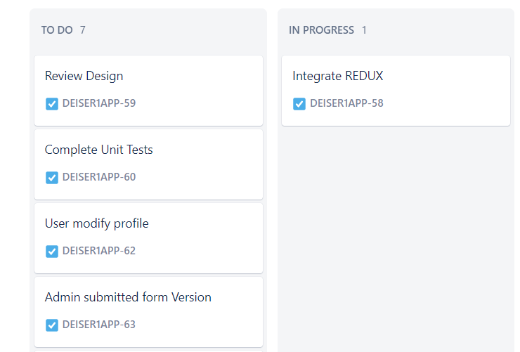
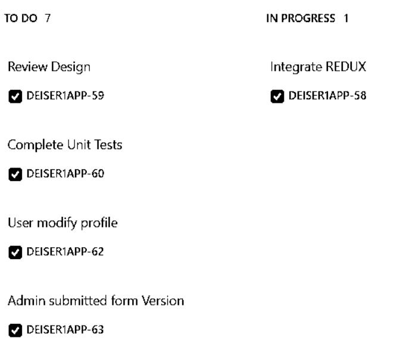
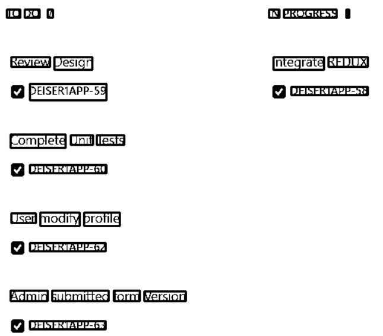
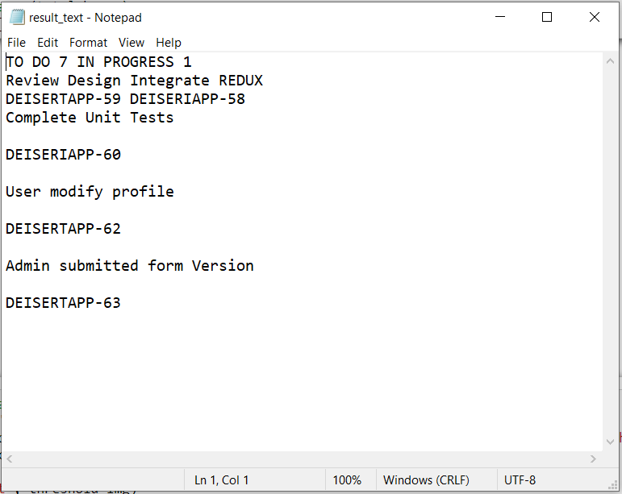

# Scénario 2: Input sous format image

Pour mieux expliquer le processus de détection des blocs de texte contenus dans une image, on a pris comme exemple d’input une image composée de 2 grands blocs, chacun est composé d’autres blocs contenant du texte.
## a)	Détection des blocs de texte

Grâce à OpenCV, le prétraitement de l’imasge se répartit sur 2 étapes principales.
Le 1er prétraitement consiste à éliminer les couleurs, les contours et le fond de l’image.
 

Le 2ème prétraitement consiste à la détection des objets –dans notre cas ce sont les mots- qui constituent le texte dans l’image. 
 

## b)	Reconnaissance de texte :
Grâce à Pytessaract, chaque objet détecté a été converti en une chaîne de caractères.
Remarque :  La détection des blocs de texte a abouti à une détection par ligne de texte et non par bloc.
 

