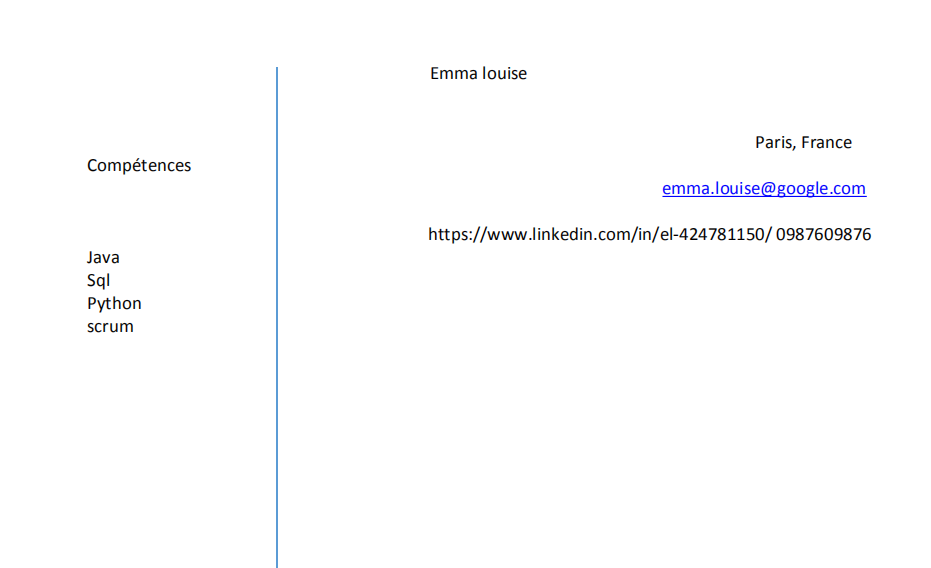
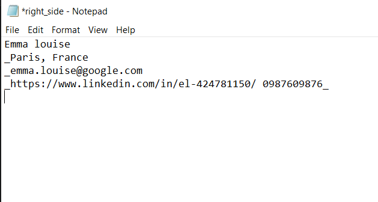
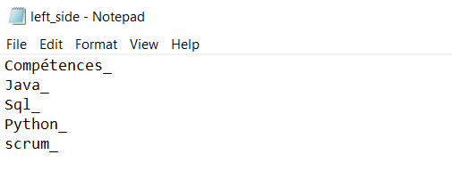

# Scénario 2: Input sous format image

Comme PDFMiner permet d’extraire des informations à partir des documents PDF grâce à l’obtention de l’emplacement exact du texte dans une page, les lignes et l'analyse de données textuelles, on a utilisé cette bibliothèque en deuxième lieu.

L’input est un CV sous format pdf.
Pdfminer détectera donc les blocs de texte existants dans le CV. Puis il reconnaîtra le texte contenu dans ces blocs. 
Nous avons opté pour la répartition du texte sur 2 partie : droite et gauche pour pouvoir manipuler le texte facilement, puis chaque partie est enregistrée dans un fichier texte .

